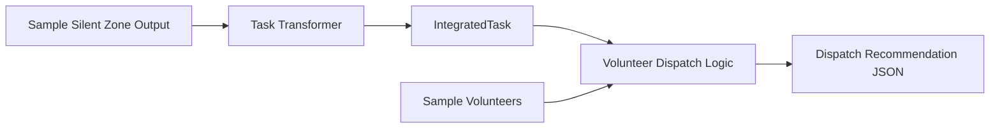

<p align="right">
<a href="./README.md">繁體中文</a> | English
</p>

# Silent Disaster Zone Detection API × Disaster Volunteer Dispatcher API

> Dual Disaster Decision Chain
> Identify high-risk areas that may be underreported, then recommend suitable volunteers for field-check, rescue, or support tasks.

This repository is the **submission entry point and integration demo repository** for the disaster-response component competition.  
This project is not a monolithic disaster-response platform. It is a modular chain composed of two independent, reusable, and integrable disaster-response components.

---

## Judge Entry Point: Recommended Review Order

To review the actual component implementations, please start with the two original repositories below.  
This repository explains how the two components are connected into one disaster decision-support chain.

| Review Order | Repository | Role | What to Review |
|---|---|---|---|
| 1 | [Silent Disaster Zone Detection API](https://github.com/cloud-driver/silent-disaster-zone-api) | Identifies high-risk but low-report “silent disaster zones” | README, API endpoints, sample inputs and outputs, JSON / CSV / GeoJSON results |
| 2 | [Disaster Volunteer Dispatcher API](https://github.com/D4rk-N355/disaster_rescuing) | Recommends volunteers based on tasks, skills, location, and availability | README, API endpoints, Pydantic schemas, Ollama / fallback dispatch logic |
| 3 | [`examples/integration_demo.py`](./examples/integration_demo.py) in this repository | Demonstrates how the two components are connected | Converts silent-zone results into tasks and generates volunteer dispatch recommendations |

This repository does not replace the two component repositories.  
Instead, it provides:

1. The integrated story of the dual-component workflow
2. The shared `IntegratedTask` data format
3. A runnable integration demo
4. OpenAPI / JSON Schema / documentation navigation
5. A complete submission entry point

---

## 30-Second Summary

After a disaster, the first visible areas are usually the places that have already reported damage.  
However, the most dangerous places may be silent due to communication failure, elderly population, road disruption, or limited digital access.

This project therefore provides two modular components:

| Component | Problem Solved | Output |
|---|---|---|
| Silent Disaster Zone Detection API | Which areas are high-risk but underreported? | High-risk low-report areas, silent risk scores, GeoJSON / CSV / JSON |
| Disaster Volunteer Dispatcher API | After high-risk areas are found, who should check or support them? | Volunteer candidates, dispatch recommendations, human-review warnings |

Core flow:

```text
Silent Disaster Zone Detection API
        ↓
High-risk Low-report Areas
        ↓
IntegratedTask Standard Format
        ↓
Disaster Volunteer Dispatcher API
        ↓
Dispatch Recommendations
```

---

## Why Both Functions Are Needed

Finding high-risk areas is not enough.

In real disaster response, decision makers need an actionable flow:

1. Which areas may be overlooked?
2. Which areas require proactive field checks?
3. Which tasks are the most urgent?
4. Which volunteers have the required skills?
5. Who is nearby and available?
6. Which recommendations require human review?

This project connects two components into one decision chain:

- **Silent Disaster Zone Detection API** helps the system see overlooked risks.
- **Disaster Volunteer Dispatcher API** helps convert those risks into actionable assignments.

This follows the modular component design principle:  
each component can work independently, while also being reusable, replaceable, and integrable with other systems.

---

## Quick Run: Integration Demo

This repository provides an integration demo that runs without external API keys.  
It reads sample silent-zone results and volunteer data, then generates tasks and dispatch recommendations.

```bash
python3 examples/integration_demo.py
```

The demo generates:

```text
examples/sample_dispatch_output.json
```

The demo shows how to:

1. Read silent disaster zone detection results
2. Convert high-risk low-report areas into `IntegratedTask`
3. Recommend volunteers based on task needs, skills, location, and availability
4. Avoid assigning the same volunteer to multiple tasks
5. Add human-review warnings when skills are missing or risks are high

---

## Integration Demo Data Flow



---

## Core Components

| Component | Original Repository | Local Snapshot in This Repo | Description |
|---|---|---|---|
| Silent Disaster Zone Detection API | [cloud-driver/silent-disaster-zone-api](https://github.com/cloud-driver/silent-disaster-zone-api) | [`components/silent-disaster-zone-api/`](./components/silent-disaster-zone-api/) | Detects high-risk but low-report areas |
| Disaster Volunteer Dispatcher API | [D4rk-N355/disaster_rescuing](https://github.com/D4rk-N355/disaster_rescuing) | [`components/disaster-rescuing/`](./components/disaster-rescuing/) | Generates volunteer dispatch recommendations |

> The `components/` folder contains local snapshots of the two components for review convenience after cloning this repository.  
> However, the original repositories remain the recommended entry points for component-level review.

---

## Input / Process / Output

| Stage | Input | Process | Output |
|---|---|---|---|
| Silent zone detection | Village data, risk data, report data, road status, demographic features | Calculate silent risk scores and identify high-risk low-report areas | Area list, JSON / CSV / GeoJSON |
| Task transformation | Silent zone detection results | Convert area risk into field-check or rescue tasks | `IntegratedTask` |
| Volunteer dispatch | Task data and volunteer data | Skill matching, distance calculation, availability check, duplicate-assignment prevention | Dispatch recommendations, volunteer candidates, human-review warnings |

---

## Repository Structure

```text
.
├── README.md
├── README.en.md
├── components/
│   ├── README.md
│   ├── README.en.md
│   ├── silent-disaster-zone-api/
│   └── disaster-rescuing/
├── docs/
│   ├── quickstart.md
│   ├── diagrams.md
│   ├── architecture.md
│   ├── api_contract.md
│   ├── ai_usage.md
│   ├── ai_governance.md
│   ├── data_sources.md
│   └── limitations.md
├── examples/
│   ├── integration_demo.py
│   ├── sample_silent_zone_output.json
│   ├── sample_volunteers.json
│   └── sample_dispatch_output.json
├── schemas/
│   └── integrated_task.schema.json
├── openapi/
│   └── integrated-flow-api.yaml
└── SUBMISSION_CHECKLIST.md
```

---

## Important Documents

| Document | Description |
|---|---|
| [Quickstart](./docs/quickstart.en.md) | How to run the integration demo locally |
| [System Diagrams](./docs/diagrams.en.md) | Mermaid architecture and data-flow diagrams |
| [Architecture](./docs/architecture.en.md) | Dual-component architecture and boundaries |
| [API and Data Contract](./docs/api_contract.en.md) | API and data format description |
| [IntegratedTask JSON Schema](./schemas/integrated_task.schema.json) | Standard task format connecting the two components |
| [Integration Flow OpenAPI](./openapi/integrated-flow-api.yaml) | Integration data contract |
| [Data Sources and Integration Plan](./docs/data_sources.en.md) | MVP data and future production data integration |
| [AI Usage](./docs/ai_usage.en.md) | The role of AI in the system |
| [AI Governance and Usage Boundaries](./docs/ai_governance.en.md) | AI risks, limits, and human-review principles |
| [Limitations and Risks](./docs/limitations.en.md) | MVP limitations, data limitations, and deployment risks |
| [Submission Checklist](./SUBMISSION_CHECKLIST.en.md) | Final checklist before submission |

---

## AI Usage and Governance Principles

This project may use AI to support analysis and dispatch recommendations, but AI does not make final decisions.

AI / algorithms may help with:

- Summarizing risk factors
- Generating task descriptions
- Matching volunteer skills
- Ranking volunteer candidates
- Explaining dispatch recommendations

AI / algorithms must not replace:

- Disaster severity declaration
- Evacuation orders
- Field command
- Actual volunteer dispatch decisions
- Individual life-safety judgment

All dispatch recommendations should be treated as **decision-support information**, not automatic commands.

---

## MVP Scope

The current MVP validates the data flow and component integration:

- Generate high-risk low-report areas from sample data
- Convert areas into standard tasks
- Generate dispatch recommendations from volunteer data
- Output structured JSON
- Demonstrate human-review warnings

The MVP does not claim that:

- All real-time government data sources are fully integrated
- The system can be directly used for real disaster dispatch
- AI results can replace emergency command decisions
- Volunteer data authorization and privacy governance are fully completed

---

## Security and Privacy Notes

This repository should not contain:

- API keys
- tokens
- passwords
- `.env`
- real volunteer personal data
- real contact information
- private IPs, Tailscale IPs, or ngrok URLs
- unauthorized real GPS trajectory data

Sample data is used only to demonstrate data formats and workflows. It does not represent real disaster results.

---

## License

This project is prepared for competition submission and demonstration.  
If released as an open-source component in the future, MIT or Apache 2.0 is recommended, with third-party data and package licenses reviewed for compatibility.