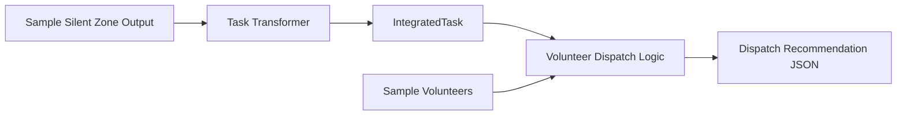

<p align="right">
繁體中文 | <a href="./README.en.md">English</a>
</p>

# 沉默災區偵測 API × 救災志工智慧分配 API 

> 本雙元件防災決策鏈是為了找出可能被忽略的高風險區域，並把確認、巡查或救援任務派給最適合的志工。

本 repository 是「防災積木元件創新賽」的**交件入口與整合展示 repo**。  
本作品不是單一大型防災平台，而是由兩個可獨立運作、可重複使用、可被其他系統串接的防災元件組成。

---

## 評審入口：建議閱讀順序

若要審查實際元件實作，請優先進入以下兩個原始 repository。  
本 repo 則負責說明兩個元件如何被拼接成一條完整的防災決策鏈。

| 審查順序 | Repository | 功能定位 | 建議看什麼 |
|---|---|---|---|
| 1 | [Silent Disaster Zone Detection API](https://github.com/cloud-driver/silent-disaster-zone-api) | 找出高風險但低通報的「沉默災區」 | README、API endpoint、樣本輸入輸出、JSON / CSV / GeoJSON 結果 |
| 2 | [Disaster Volunteer Dispatcher API](https://github.com/D4rk-N355/disaster_rescuing) | 根據任務、志工技能、位置與可用狀態產生派遣建議 | README、API endpoint、Pydantic schema、Ollama / fallback dispatch logic |
| 3 | 本 repo 的 [`examples/integration_demo.py`](./examples/integration_demo.py) | 展示兩個元件如何串接 | 沉默災區結果如何轉成任務，再產生志工派遣建議 |

本 repo 的角色不是取代兩個子 repo，而是提供：

1. 雙元件整合故事
2. 整合資料格式 `IntegratedTask`
3. 可執行的整合 demo
4. OpenAPI / JSON Schema / 文件導覽
5. 交件用的完整說明入口

---

## 30 秒摘要

災害發生後，系統通常最先看到的是「有通報的地方」。  
但真正危險的地方，可能因為斷訊、高齡人口、道路中斷或數位能力不足，反而沒有人回報。

因此，本作品設計兩個可拼接元件：

| 元件 | 解決的問題 | 輸出 |
|---|---|---|
| 沉默災區偵測 API | 哪些地方可能高風險但低通報？ | 高風險低通報區域、沉默風險分數、GeoJSON / CSV / JSON |
| 救災志工智慧分配 API | 找到高風險區域後，誰最適合去確認或支援？ | 志工候選名單、推薦派遣結果、人工覆核警告 |

核心流程：

```text
沉默災區偵測 API
        ↓
高風險但低通報區域
        ↓
IntegratedTask 標準任務格式
        ↓
救災志工智慧分配 API
        ↓
志工派遣建議
```

---

## 為什麼兩個功能都要做？

只找出高風險區域還不夠。

在災害現場，指揮端真正需要的是一條可行動的流程：

1. 哪些地方可能被忽略？
2. 哪些地方需要主動巡查？
3. 哪些任務最緊急？
4. 哪些志工具備合適技能？
5. 誰離現場較近、目前可用？
6. 哪些建議需要人工覆核？

所以本作品把兩個元件串成一條決策鏈：

- **沉默災區偵測 API** 負責「看見問題」
- **救災志工智慧分配 API** 負責「把問題轉成可執行任務」

這樣的設計符合積木式元件精神：  
每個元件可以獨立運作，也可以被其他系統重複使用或替換。

---

## 快速執行整合 Demo

本 repo 提供一個不需要外部 API key 的整合 demo。  
它會讀取樣本沉默災區結果與志工資料，產生任務與派遣建議。

```bash
python3 examples/integration_demo.py
```

執行後會產生：

```text
examples/sample_dispatch_output.json
```

Demo 會展示：

1. 讀取沉默災區偵測結果
2. 將高風險低通報區域轉成 `IntegratedTask`
3. 根據任務需求、志工技能、位置與可用狀態進行推薦
4. 避免同一位志工被重複派遣
5. 在技能不足或高風險任務時標示人工覆核警告

---

## 整合 Demo 資料流



---

## 核心元件

| 元件 | 原始 repository | 本 repo 本地快照 | 說明 |
|---|---|---|---|
| 沉默災區偵測 API | [cloud-driver/silent-disaster-zone-api](https://github.com/cloud-driver/silent-disaster-zone-api) | [`components/silent-disaster-zone-api/`](./components/silent-disaster-zone-api/) | 分析高風險但低通報區域 |
| 救災志工智慧分配 API | [D4rk-N355/disaster_rescuing](https://github.com/D4rk-N355/disaster_rescuing) | [`components/disaster-rescuing/`](./components/disaster-rescuing/) | 根據任務與志工資料產生派遣建議 |

> `components/` 內保留兩個元件的本地快照，方便評審 clone 本 repo 後查看完整結構。  
> 但兩個元件的主要審查入口仍建議以原始 repository 為準。

---

## Input / Process / Output

| 階段 | Input | Process | Output |
|---|---|---|---|
| 沉默災區偵測 | 村里資料、風險資料、通報資料、道路狀態、人口特徵 | 計算沉默風險分數，辨識高風險但低通報區域 | 高風險區域清單、JSON / CSV / GeoJSON |
| 任務轉換 | 沉默災區偵測結果 | 將區域風險轉換成巡查或救援任務 | `IntegratedTask` |
| 志工分配 | 任務資料、志工資料 | 技能比對、距離計算、可用性判斷、重複派遣避免 | 派遣建議、候選志工、人工覆核警告 |

---

## Repository 結構

```text
.
├── README.md
├── README.en.md
├── components/
│   ├── README.md
│   ├── README.en.md
│   ├── silent-disaster-zone-api/
│   └── disaster-rescuing/
├── docs/
│   ├── quickstart.md
│   ├── diagrams.md
│   ├── architecture.md
│   ├── api_contract.md
│   ├── ai_usage.md
│   ├── ai_governance.md
│   ├── data_sources.md
│   └── limitations.md
├── examples/
│   ├── integration_demo.py
│   ├── sample_silent_zone_output.json
│   ├── sample_volunteers.json
│   └── sample_dispatch_output.json
├── schemas/
│   └── integrated_task.schema.json
├── openapi/
│   └── integrated-flow-api.yaml
└── SUBMISSION_CHECKLIST.md
```

---

## 重要文件

| 文件 | 說明 |
|---|---|
| [快速開始](./docs/quickstart.md) | 如何在本機執行整合 demo |
| [系統流程圖](./docs/diagrams.md) | Mermaid 架構圖與資料流 |
| [系統架構](./docs/architecture.md) | 雙元件架構與邊界 |
| [API 與資料交換規格](./docs/api_contract.md) | API 與資料格式說明 |
| [IntegratedTask JSON Schema](./schemas/integrated_task.schema.json) | 兩個元件之間的標準任務格式 |
| [整合流程 OpenAPI](./openapi/integrated-flow-api.yaml) | 整合流程資料交換契約 |
| [資料來源與接入規劃](./docs/data_sources.md) | MVP 資料與正式資料接入規劃 |
| [AI 使用說明](./docs/ai_usage.md) | AI 在系統中的角色 |
| [AI 治理與使用邊界](./docs/ai_governance.md) | AI 風險、限制與人工覆核原則 |
| [限制與風險](./docs/limitations.md) | MVP 限制、資料限制與部署風險 |
| [交件檢查表](./SUBMISSION_CHECKLIST.md) | 交件前最後確認項目 |

---

## AI 使用與治理原則

本作品可以使用 AI 輔助分析與派遣建議，但不讓 AI 直接做最終決策。

AI / 演算法可協助：

- 整理風險因素
- 產生任務描述
- 比對志工技能
- 排序候選志工
- 產生派遣建議理由

AI / 演算法不可取代：

- 災害等級判定
- 撤離命令
- 現場指揮
- 志工實際派遣決策
- 對個人生命安全狀態的判定

所有派遣建議都應視為**決策輔助資訊**，而非自動命令。

---

## MVP 範圍

目前 MVP 驗證的是資料流與元件拼接方式：

- 可用樣本資料產生高風險低通報區域
- 可將區域轉換為標準任務
- 可根據志工資料產生派遣建議
- 可輸出結構化 JSON
- 可展示人工覆核警告

目前尚未宣稱：

- 已正式接入所有政府即時資料
- 可直接用於真實災害派遣
- AI 結果可取代指揮中心決策
- 志工資料已完成正式授權與個資治理

---

## 安全與個資注意事項

本 repo 不應包含：

- API key
- token
- 密碼
- `.env`
- 真實志工個資
- 真實聯絡方式
- 私人 IP、Tailscale IP、ngrok URL
- 未授權的真實 GPS 軌跡資料

樣本資料僅用於展示資料格式與流程，不代表真實災害結果。

---

## 授權

本作品為競賽提交與展示用途。  
若後續上架為開源元件，建議採用 MIT 或 Apache 2.0 授權，並確認所有第三方資料與套件授權相容。