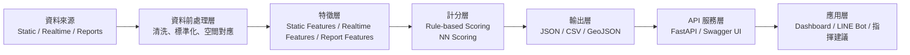

# Silent Disaster Zone Detection API

> **防災積木元件創新賽｜沉默災區偵測、LINE 民眾回報與已驗證事件整合 API**
>
> 用於辨識「**高風險、低觀測、低通報**」的村里，協助防災人員主動確認可能被既有通報系統忽略的區域；同時提供 LINE 民眾回報、人工查證、已驗證事件快照、規則式指揮隊列與受限制的 AI 摘要。

Repository: https://github.com/cloud-driver/silent-disaster-zone-api

---

## 目錄

- [專案定位](#專案定位)
- [核心能力](#核心能力)
- [安全與使用界線](#安全與使用界線)
- [系統架構與資料流](#系統架構與資料流)
- [風險計分與雙隊列](#風險計分與雙隊列)
- [LINE 民眾回報流程](#line-民眾回報流程)
- [資料模式與輸出可信度](#資料模式與輸出可信度)
- [環境需求與安裝](#環境需求與安裝)
- [環境變數設定](#環境變數設定)
- [啟動 API 與 Swagger Portal](#啟動-api-與-swagger-portal)
- [登入與 API 驗證](#登入與-api-驗證)
- [API 總覽](#api-總覽)
- [即時資料流程](#即時資料流程)
- [測試](#測試)
- [輸出格式](#輸出格式)
- [專案結構](#專案結構)
- [資料與隱私政策](#資料與隱私政策)
- [限制與後續方向](#限制與後續方向)

---

## 專案定位

傳統災情系統通常依賴「已發生且已通報」的資料來排序。然而，真正需要優先確認的區域，可能因為通訊中斷、交通受阻、感測器不足、高齡人口比例高、數位通報能力不足等因素，反而沒有即時回報。

本專案關注的不是「哪裡通報最多」，而是：

```text
高風險
＋ 觀測不足
＋ 通報不足
＝ 值得優先主動確認的沉默災區候選區域
```

本元件定位為可重複整合的 **Service Component / API Component**，可被接入：

- 災害應變儀表板
- 地圖與 GIS 圖台
- 巡查派工或志工調度系統
- LINE 官方帳號民眾回報流程
- 地方災情查報與人工審核流程
- 其他防災資料平台

---

## 核心能力

### 1. 沉默災區偵測

- 以花蓮縣村里為 MVP 分析單位。
- 整合靜態災害風險、感測器覆蓋缺口、即時事件訊號與近時通報活動。
- 產出可供 API、表格、地圖使用的 JSON、CSV、GeoJSON。

### 2. 即時資料一致性

- 即時抓取會建立單一 `run_id`。
- 同一輪正規化與計分只使用該 `run_id` 的 raw snapshots。
- 以 `outputs/latest/run_manifest.json` 記錄資料來源、抓取狀態、輸出路徑與生成時間。
- 外部來源失敗時會保留來源狀態，不會將舊資料偽裝為最新資料。

### 3. LINE 民眾災情回報

- 支援災情類型、嚴重程度、LINE 位置與文字描述。
- 原始 LINE user ID 不會直接寫入通報資料表，而是以 HMAC 雜湊保存。
- 每筆 LINE 回報先進入 `pending`，不會直接影響正式風險排序。
- webhook 使用 `X-Line-Signature` 驗證，並以 `webhookEventId` 避免重複處理。

### 4. 人工查證與已驗證事件

- 管理者可將回報審核為 `verified` 或 `rejected`。
- 僅 `verified` 通報會被納入 live pipeline 的近 6 / 24 小時通報特徵。
- 已驗證事件會另外形成 incident queue，不會與「沉默」概念混在同一份清單中。

### 5. 規則式決策支援與 AI 摘要

- 正式排序使用可解釋的 `rule_based_mvp`。
- AI / Ollama 僅將既有的規則式隊列整理成人可讀摘要。
- AI 不可變更排序、不可新增村里、不可宣稱災害已發生、不可發布撤離或封路命令。
- Ollama 不可用時，規則式 `command_plan` 仍可使用。

### 6. 安全 API 與完整 Swagger Portal

- 登入後取得唯一短效 Bearer Token，固定有效 **15 分鐘**。
- `/auth/login` 同 IP 在滑動 60 秒內最多可呼叫 **5 次**。
- 一般 API 需要 Bearer Token。
- 高權限管理操作另需要固定 `REPORT_ADMIN_KEY`。
- Swagger UI 依功能分組、以 API 編號呈現，並標示輸入欄位的位置、必填性、預設值、用途與範例。

---

## 安全與使用界線

本系統是**決策支援元件**，不是官方災害宣告、救災派遣或強制命令系統。

請務必遵守：

1. `silent_risk_score` 代表「主動確認優先程度」，**不代表災害已發生**。
2. `pending` 民眾回報尚未人工確認，**不得當作已驗證災情**。
3. `verified` 回報代表已完成人工查證，但仍不等同官方災害宣告。
4. 不得直接以 API 或 AI 輸出作為撤離、封路、停班停課、資源強制調度等命令依據。
5. AI 只負責整理資料；最終判斷與行動仍須由具權責的人員完成。

---

## 系統架構與資料流



---

## 風險計分與雙隊列

### 正式沉默風險公式

批次 pipeline 與即時 pipeline 共用：

```text
src/scoring/silent_risk.py
```

正式排序欄位：

```text
silent_risk_score
silent_risk_rule_score
silent_risk_level
scoring_mode = rule_based_mvp
model_status = not_applied 或實驗性狀態
```

核心計算概念：

```text
recent_report_score
= min(report_count_6h / 3, 1)

older_report_score
= min(max(report_count_24h - report_count_6h, 0) / 6, 1)

report_activity_score
= 0.70 × recent_report_score
+ 0.30 × older_report_score

silence_factor
= 1 - report_activity_score

risk_evidence_score
= 0.55 × static_risk_score
+ 0.20 × sensor_realtime_score
+ 0.25 × realtime_event_score

observation_gap_score
= sensor_gap_score

silent_risk_score
= risk_evidence_score
× (0.50 + 0.50 × observation_gap_score)
× silence_factor
```

解讀原則：

- 風險證據高、觀測缺口高、近時通報少：沉默風險上升。
- 已有 verified 通報：沉默因子降低，代表該區不再是「完全沉默」。
- 這不代表已通報區域不重要，因此系統額外建立已驗證事件隊列。

### 隊列 A：`silent_watch_queue`

此隊列來自 `silent_risk_score`，主要回答：

> 哪些區域可能因為低觀測與低通報而需要主動確認？

優先等級：

| 等級 | 規則 |
|---|---|
| `P1` | `silent_risk_score >= 0.55` |
| `P2` | `0.35 <= silent_risk_score < 0.55` |
| `P3` | `silent_risk_score < 0.35` |

### 隊列 B：`verified_incident_queue`

此隊列來自人工審核為 `verified` 的通報，主要回答：

> 哪些區域已有可信事件資訊，需要進一步人員研判？

優先等級：

| 等級 | 判定概念 |
|---|---|
| `I1` | 受困人員類型，或嚴重程度 3 |
| `I2` | 嚴重程度 2，或積淹水、土石／落石、道路中斷等事件 |
| `I3` | 其他已驗證、但相對低優先的事件 |

---

## LINE 民眾回報流程

### 使用者流程

```text
使用者輸入「災情回報」
        ↓
選擇災情類型
        ↓
選擇嚴重程度（1 / 2 / 3）
        ↓
傳送 LINE 位置
        ↓
輸入文字描述
        ↓
確認送出
        ↓
建立 status = pending 的通報
        ↓
管理者審核為 verified 或 rejected
```

支援類型：

| 代碼 | 類型 |
|---|---|
| `flooding` | 積淹水 |
| `landslide` | 土石／落石 |
| `road_blocked` | 道路中斷 |
| `trapped_people` | 受困／需協助 |
| `power_or_comms` | 停電／通訊異常 |
| `other` | 其他 |

### 通報資料生命週期

```text
LINE / manual / API
        ↓
pending
        ├── verified → 可進入 live report features 與 incident queue
        └── rejected → 保留審核記錄，但不納入正式分析
```

### 隱私設計

- LINE user ID 先以 `REPORTER_HASH_SECRET` 做 HMAC 雜湊。
- `data/reports/` 預設不提交至 Git。
- 不建議要求使用者回報身分證號、電話、完整住址等敏感個資。
- 線上正式部署前，應建立資料保存期間、管理者權限與個資告知機制。

---

## 資料模式與輸出可信度

所有主要風險 API 會回傳 `meta`，用來揭露資料狀態。

| 欄位 | 說明 |
|---|---|
| `data_mode` | `live`、`batch`、`sample` 或 `unverified` |
| `verification` | 是否由完成的 manifest 驗證 |
| `pipeline_status` | pipeline 的目前狀態 |
| `run_id` | 當輪資料處理識別碼 |
| `generated_at` | 產出生成時間 |
| `generated_age_seconds` | 資料年齡（秒） |
| `freshness` | `fresh`、`stale`、`expired`、`not_realtime`、`sample_data` 或 `unknown` |
| `source_status` | 即時資料來源抓取狀態 |
| `has_source_issues` | 是否存在抓取失敗或略過的來源 |
| `scoring_mode` | 正式計分模式 |
| `model_status` | 神經網路層的應用狀態 |

### 資料模式解讀

| 模式 | 意義 | 使用建議 |
|---|---|---|
| `live` | 同一輪即時資料 pipeline 已完成 | 可作為人工確認優先順序參考 |
| `batch` | 完整批次 pipeline 產出 | 不應宣稱為即時資料 |
| `sample` | Repository 內建展示資料 | 僅供 API / UI demo |
| `unverified` | 找到輸出檔，但缺乏可信 manifest | 需先人工檢查 |

---

## 環境需求與安裝

### 建議環境

- Python **3.12**
- FastAPI + Uvicorn
- GeoPandas、Shapely、PyProj
- pandas、NumPy、scikit-learn
- SQLite（Python 內建）
- 可選：Ollama（本地 AI 摘要）

### macOS / Linux

```bash
git clone https://github.com/cloud-driver/silent-disaster-zone-api.git
cd silent-disaster-zone-api

python3 -m venv .venv
source .venv/bin/activate
python3 -m pip install -r requirements.txt

cp .env.example .env
```

### Windows PowerShell

```powershell
git clone https://github.com/cloud-driver/silent-disaster-zone-api.git
cd silent-disaster-zone-api

py -3.12 -m venv .venv
.\.venv\Scripts\Activate.ps1
python -m pip install -r requirements.txt

Copy-Item .env.example .env
```

PowerShell 若阻擋 virtual environment 啟用：

```powershell
Set-ExecutionPolicy -Scope Process -ExecutionPolicy Bypass
.\.venv\Scripts\Activate.ps1
```

---

## 環境變數設定

請由 `.env.example` 複製為 `.env` 後設定。**不可提交 `.env`。**

| 變數 | 必填 | 用途 |
|---|---:|---|
| `CWA_API_KEY` | 即時資料流程需要 | 中央氣象署資料 API Key |
| `ENV` | 否 | 執行環境標記，預設可設為 `development` |
| `OLLAMA_BASE_URL` | 否 | Ollama URL，預設 `http://127.0.0.1:11434` |
| `OLLAMA_MODEL` | 否 | Ollama 模型名稱，例如 `qwen2.5:7b` |
| `REPORT_ADMIN_KEY` | 管理 API 需要 | 高權限管理操作的固定第二層金鑰 |
| `REPORTER_HASH_SECRET` | LINE 回報需要 | 雜湊 LINE user ID 的私密 Key |
| `LINE_CHANNEL_SECRET` | LINE webhook 需要 | 驗證 LINE webhook 簽章 |
| `LINE_CHANNEL_ACCESS_TOKEN` | LINE 回覆需要 | 呼叫 LINE Reply API 的 Access Token |
| `AUTH_LOGIN_USERNAME` | 登入 API 需要 | API 登入帳號 |
| `AUTH_LOGIN_PASSWORD_HASH` | 登入 API 需要 | PBKDF2 雜湊後的登入密碼 |
| `AUTH_STORAGE_SECRET` | 登入 API 需要 | 雜湊 access token 與來源 IP 的私密 Key |
| `AUTH_TRUST_PROXY_HEADERS` | 否 | 僅在可信任 reverse proxy 前設定為 `true` |
| `AUTH_DB_PATH` | 否 | 自訂登入 Session SQLite 路徑 |
| `REPORT_DB_PATH` | 否 | 自訂通報 SQLite 路徑 |

### 產生登入密碼 Hash 與 Storage Secret

以下指令不會把明碼密碼寫進終端紀錄：

```bash
python3 - <<'PY'
import secrets
from getpass import getpass

from src.auth.store import hash_password

password = getpass("設定 API 登入密碼：")
confirm = getpass("再次輸入密碼：")

if password != confirm:
    raise SystemExit("兩次密碼不同，已取消。")

print()
print("AUTH_LOGIN_PASSWORD_HASH=" + hash_password(password))
print("AUTH_STORAGE_SECRET=" + secrets.token_urlsafe(48))
PY
```

將輸出的兩行，以及帳號設定寫入 `.env`：

```env
AUTH_LOGIN_USERNAME=api-admin
AUTH_LOGIN_PASSWORD_HASH=貼上上一步產生的完整雜湊
AUTH_STORAGE_SECRET=貼上上一步產生的完整隨機字串
```

### 產生 Report Admin 與 LINE 雜湊 Secret

```bash
python3 - <<'PY'
import secrets

print("REPORT_ADMIN_KEY=" + secrets.token_urlsafe(32))
print("REPORTER_HASH_SECRET=" + secrets.token_urlsafe(32))
PY
```

> `AUTH_TRUST_PROXY_HEADERS=true` 僅適用於 Uvicorn 綁定 localhost，且前方確實由你信任的 Caddy / Nginx 代理時。若直接公開 Uvicorn，不應信任外部客戶端傳入的 `X-Forwarded-For`。

---

## 啟動 API 與 Swagger Portal

啟動開發伺服器：

```bash
python -m uvicorn src.api.main:app --reload
```

固定監聽本機：

```bash
python -m uvicorn src.api.main:app --host 127.0.0.1 --port 8000
```

文件入口：

```text
Swagger API Portal: http://127.0.0.1:8000/docs
ReDoc Reference:    http://127.0.0.1:8000/redoc
OpenAPI JSON:       http://127.0.0.1:8000/openapi.json
```

Swagger Portal 提供：

- API 分組與編號，例如 `【10-1】`、`【20-2】`。
- 每個輸入欄位的傳遞位置、必填性、預設值、說明與範例。
- Bearer Token 與 `REPORT_ADMIN_KEY` 的 Authorize 介面。
- 可搜尋、可 Try it out、可檢視回應時間。

---

## 登入與 API 驗證

### 公開路由

下列路由不需要 Bearer Token：

```text
POST /auth/login
GET  /health
GET  /advisor/health
GET  /line/health
POST /line/webhook
GET  /docs
GET  /redoc
GET  /openapi.json
```

說明：

- `/auth/login`：登入入口，同 IP 在滑動 60 秒內最多 5 次。
- `/line/webhook`：不使用 Bearer Token，改用 LINE `X-Line-Signature` 驗證。
- `/health`、`/advisor/health`、`/line/health`：供健康檢查使用。

### Bearer Token

除公開路由外，所有 API 都必須帶：

```http
Authorization: Bearer <access_token>
```

Token 的特性：

- 每次成功登入產生唯一 token。
- 固定有效 **900 秒（15 分鐘）**。
- 每次 API 使用不會延長到期時間。
- `/auth/logout` 後立即失效。
- 伺服器只保存 token 的雜湊值，不保存原始 token。

### `REPORT_ADMIN_KEY` 的第二層保護

以下高權限 API 需要：

1. Bearer Token
2. `X-Admin-Key: <REPORT_ADMIN_KEY>`

```text
GET  /reports/pending
POST /reports/{report_id}/review
GET  /incidents/verified
GET  /advisor/command
POST /pipeline/run
```

> `/advisor/command` 目前在程式實作中也要求 `REPORT_ADMIN_KEY`，因為它可讀取已驗證事件與產生決策支援結果。

### 登入範例

```bash
curl -s \
  -X POST http://127.0.0.1:8000/auth/login \
  -H "Content-Type: application/json" \
  -d '{
    "username": "api-admin",
    "password": "你的登入密碼"
  }' \
  | python3 -m json.tool --no-ensure-ascii
```

取得 token：

```bash
TOKEN=$(
  curl -s \
    -X POST http://127.0.0.1:8000/auth/login \
    -H "Content-Type: application/json" \
    -d '{
      "username": "api-admin",
      "password": "你的登入密碼"
    }' \
  | python3 -c 'import json, sys; print(json.load(sys.stdin)["access_token"])'
)
```

使用一般 API：

```bash
curl -s \
  -H "Authorization: Bearer $TOKEN" \
  "http://127.0.0.1:8000/silent-risk/top?limit=5" \
  | python3 -m json.tool --no-ensure-ascii
```

使用管理 API：

```bash
curl -s \
  -H "Authorization: Bearer $TOKEN" \
  -H "X-Admin-Key: 你的REPORT_ADMIN_KEY" \
  "http://127.0.0.1:8000/reports/pending?limit=20" \
  | python3 -m json.tool --no-ensure-ascii
```

Swagger 使用方式：

```text
1. 使用【01-1】登入並取得 15 分鐘 Token。
2. 複製 access_token 原始內容。
3. 點 Swagger 右上角 Authorize。
4. 在 BearerAccessToken 貼上 token 本體，不要自行加 Bearer。
5. 欲使用管理 API 時，再填入 ReportAdminKey。
```

---

## API 總覽

> 所有欄位、必填性、預設值與 request / response 範例請以 Swagger Portal 為準。

| 編號 | Method | Path | Bearer Token | `REPORT_ADMIN_KEY` | 說明 |
|---|---|---|---:|---:|---|
| `00-1` | GET | `/` | 是 | 否 | API 入口資訊 |
| `00-2` | GET | `/health` | 否 | 否 | 系統與資料健康狀態 |
| `00-3` | GET | `/model/info` | 是 | 否 | 實驗模型 metadata |
| `01-1` | POST | `/auth/login` | 否 | 否 | 登入並取得 15 分鐘 Token；同 IP 每分鐘最多 5 次 |
| `01-2` | GET | `/auth/session` | 是 | 否 | 查詢目前 Token 狀態 |
| `01-3` | POST | `/auth/logout` | 是 | 否 | 撤銷目前 Token |
| `10-1` | GET | `/silent-risk` | 是 | 否 | 查詢沉默風險清單 |
| `10-2` | GET | `/silent-risk/top` | 是 | 否 | 取得沉默風險最高村里 |
| `10-3` | GET | `/silent-risk/{village_id}` | 是 | 否 | 查詢單一村里 |
| `10-4` | GET | `/silent-risk.geojson` | 是 | 否 | 取得地圖 GeoJSON |
| `20-1` | GET | `/advisor/health` | 否 | 否 | 檢查 Ollama advisor |
| `20-2` | GET | `/advisor/command` | 是 | 是 | 取得雙隊列指揮建議 |
| `30-1` | GET | `/reports/summary` | 是 | 否 | 民眾回報統計 |
| `30-2` | GET | `/reports/pending` | 是 | 是 | 取得待審核回報 |
| `30-3` | POST | `/reports/{report_id}/review` | 是 | 是 | 審核回報為 verified / rejected |
| `40-1` | GET | `/incidents/verified` | 是 | 是 | 取得已驗證事件 snapshot |
| `50-1` | GET | `/line/health` | 否 | 否 | 檢查 LINE 設定狀態 |
| `50-2` | POST | `/line/webhook` | 否 | 否 | LINE 平台 webhook，使用簽章驗證 |
| `90-1` | POST | `/pipeline/run` | 是 | 是 | 執行完整 batch pipeline |

### 常見回應狀態碼

| 狀態碼 | 意義 |
|---:|---|
| `200` | 請求成功 |
| `401` | 缺少、無效、過期或已撤銷的 Bearer Token |
| `403` | `REPORT_ADMIN_KEY` 缺失或無效 |
| `404` | 找不到資源、輸出檔或事件 snapshot |
| `409` | 狀態衝突，例如重複審核非 `pending` 通報 |
| `422` | 請求欄位或參數格式錯誤 |
| `429` | `/auth/login` 在同 IP 的 60 秒內超過 5 次 |
| `500` | 伺服器處理或 pipeline 執行失敗 |
| `503` | 必要環境變數尚未設定 |

---

## 即時資料流程

### 單次 realtime pipeline

```bash
python scripts/fetch_realtime_sources.py
python scripts/normalize_realtime_sources.py
python scripts/build_verified_report_features.py
python scripts/compute_silent_risk_realtime.py
python scripts/apply_silent_risk_nn.py
```

流程意義：

| 步驟 | 功能 |
|---|---|
| `fetch_realtime_sources.py` | 抓取即時外部資料並保存 raw snapshots |
| `normalize_realtime_sources.py` | 依同一 `run_id` 正規化雨量、警戒與路況特徵 |
| `build_verified_report_features.py` | 將已驗證通報空間對應至村里，產生 6h / 24h 通報特徵與事件 snapshot |
| `compute_silent_risk_realtime.py` | 合併資料並使用共享規則式公式計算沉默風險 |
| `apply_silent_risk_nn.py` | 套用實驗性 NN 層；不改變正式 rule-based 排序 |

輸出位置：

```text
outputs/latest/silent_risk.json
outputs/latest/silent_risk.csv
outputs/latest/silent_risk.geojson
outputs/latest/verified_incidents.json
outputs/latest/run_manifest.json

outputs/history/{run_id}/
```

### 關於 `refresh=true`

下列 API 帶 `refresh=true` 時會同步執行 realtime pipeline：

```text
GET /silent-risk?refresh=true
GET /silent-risk/top?refresh=true
GET /advisor/command?refresh=true
```

這是阻塞式操作，可能耗時且會依賴外部資料來源、靜態資料與本機環境。建議：

- 在開發／展示環境使用。
- 在正式環境改由排程或受保護的背景工作執行。
- 不要讓不受信任的使用者頻繁呼叫。
- 請先確認資料模式與 `run_manifest.json`。

---

## 批次流程與 sample demo

### Sample output demo

Repository 內建 `sample_outputs/`，當 `outputs/latest/` 不存在時，API 會使用 sample output 作為可展示資料。

```bash
python -m uvicorn src.api.main:app --reload
```

可先查看不需登入的健康狀態：

```bash
curl -s http://127.0.0.1:8000/health \
  | python3 -m json.tool --no-ensure-ascii
```

登入後再查看 sample 資料：

```bash
curl -s \
  -H "Authorization: Bearer $TOKEN" \
  "http://127.0.0.1:8000/silent-risk/top?limit=5" \
  | python3 -m json.tool --no-ensure-ascii
```

若 `meta.data_mode` 是 `sample`，結果只供 API 展示與介面驗證，不得當作即時災害資料。

### 完整 batch pipeline

完整 batch pipeline 需要預先準備本機 raw / processed 資料。原始資料與生成物不提交到 Repository。

```bash
python scripts/run_pipeline.py
```

完成後會產生 batch manifest，API metadata 會標記：

```text
data_mode = batch
freshness = not_realtime
```

---

## 測試

執行所有單元測試：

```bash
python -m unittest discover -s tests -v
```

目前測試涵蓋：

- 沉默風險正式計分邏輯。
- 近 6 / 24 小時通報數一致性。
- 感測器缺口對排序的獨立影響。
- 必要欄位遺漏時的明確錯誤。
- LINE webhook 簽章驗證。
- LINE 災情回報的完整 session 流程。
- webhook event 去重。
- `pending → verified` 審核流程。
- verified report 的村里空間對應與 6h / 24h 特徵。
- verified incident queue 的 I1 / I2 / I3 排序。
- Swagger API 編號、輸入欄位說明、預設值與安全機制。
- 15 分鐘 Bearer Token、登出撤銷與登入速率限制。

靜態檢查：

```bash
python -m py_compile \
  src/api/main.py \
  src/api/docs.py \
  src/api/auth.py \
  src/auth/store.py \
  src/auth/middleware.py
```

---

## 輸出格式

### `silent_risk.json`

簡化範例：

```json
[
  {
    "village_id": "10015020001",
    "county_name": "花蓮縣",
    "town_name": "鳳林鎮",
    "village_name": "鳳仁里",
    "static_risk_score": 0.61,
    "sensor_gap_score": 0.61,
    "realtime_event_score": 0.0,
    "report_count_6h": 0,
    "report_count_24h": 0,
    "risk_evidence_score": 0.34,
    "observation_gap_score": 0.61,
    "report_activity_score": 0.0,
    "silence_factor": 1.0,
    "silent_risk_score": 0.27,
    "silent_risk_level": "low",
    "scoring_mode": "rule_based_mvp",
    "model_status": "not_applied"
  }
]
```

### `verified_incidents.json`

簡化範例：

```json
{
  "schema_version": "1.0",
  "run_id": "realtime_20260625_120000",
  "generated_at": "2026-06-25T12:00:00+08:00",
  "data_mode": "live",
  "report_data_source": "verified_human_reviewed_reports",
  "summary": {
    "verified_report_total": 3,
    "eligible_recent_report_count": 2,
    "matched_report_count": 2
  },
  "count": 2,
  "data": [
    {
      "incident_id": "RPT-AB12CD34EF56",
      "incident_priority": "I2",
      "village_id": "10015020001",
      "village_label": "花蓮縣鳳林鎮鳳仁里",
      "category": "flooding",
      "category_label": "積淹水",
      "severity": 2,
      "needs_human_confirmation": true
    }
  ]
}
```

---

## 神經網路實驗層

專案保留 `silent_risk_nn_score` 與相關訓練腳本，用於驗證 scoring layer 可替換架構。

但目前模型以 pseudo-label 為基礎，不是使用真實災害 ground truth，因此：

- 不得宣稱模型可準確預測災害。
- 不得以 NN 分數取代正式 rule-based 排序。
- `silent_risk_nn_score` 應視為研究與架構驗證用途。

未來可使用以下資料重訓：

- 歷史災情紀錄
- 巡查結果與現地確認紀錄
- 通報延遲資料
- 救災派遣與處置資料
- 專家標註的優先確認區域

相關文件：

- `docs/model.md`
- `models/silent_risk_mlp_metadata.json`

---

## 專案結構

```text
silent-disaster-zone-api/
├── README.md
├── requirements.txt
├── .env.example
├── docs/
│   ├── api.md
│   ├── model.md
│   ├── submission.md
│   └── schemas/
├── sample_outputs/
├── scripts/
│   ├── fetch_realtime_sources.py
│   ├── normalize_realtime_sources.py
│   ├── build_verified_report_features.py
│   ├── compute_silent_risk_realtime.py
│   ├── apply_silent_risk_nn.py
│   └── run_pipeline.py
├── src/
│   ├── advisor/
│   │   ├── command_advisor.py
│   │   ├── command_plan.py
│   │   └── incident_plan.py
│   ├── api/
│   │   ├── auth.py
│   │   ├── docs.py
│   │   ├── incidents.py
│   │   ├── line_webhook.py
│   │   ├── main.py
│   │   └── reports.py
│   ├── auth/
│   │   ├── middleware.py
│   │   └── store.py
│   ├── line_bot/
│   │   ├── client.py
│   │   ├── flow.py
│   │   └── store.py
│   ├── reports/
│   │   ├── analytics.py
│   │   └── store.py
│   ├── runtime/
│   └── scoring/
├── tests/
├── models/
└── data/
    ├── auth/       # ignored
    ├── reports/    # ignored
    ├── raw/        # ignored
    ├── processed/  # ignored
    └── realtime/   # ignored
```

---

## 資料與隱私政策

預設不提交以下資料：

```text
.env
data/auth/
data/reports/
data/raw/
data/interim/
data/processed/
data/realtime/
outputs/
models/*.joblib
```

原因：

- API Key、登入 Hash、Storage Secret 與管理金鑰不得公開。
- LINE 回報可能包含位置、文字描述與事件資訊。
- 原始政府資料可能很大，也可能需依授權或更新週期重新取得。
- 即時 snapshots 與輸出應可由 pipeline 重新生成。
- 模型 binary 檔應由訓練流程重新建立。

---

## 限制與後續方向

### 現階段限制

- MVP 範圍為花蓮縣村里層級。
- 即時資料可用性受外部 API 與網路狀態影響。
- LINE webhook 要真正接收外部使用者訊息，仍需要公開 HTTPS 網域與 LINE Developers Console 設定。
- `refresh=true` 為同步阻塞式流程，正式部署建議改為排程或背景工作。
- 機器學習層尚未使用真實 ground truth，不可宣稱預測準確性。
- 路況事件仍以規則式特徵為主，後續可細化事件分類與空間影響範圍。
- 水利署水位資料尚未完成整合。

### 建議後續工作

1. 將 realtime pipeline 改為受保護的背景 job 與排程。
2. 部署至 Linux 伺服器，使用 Caddy / Nginx 提供公開 HTTPS。
3. 設定 LINE webhook URL 並建立正式測試帳號。
4. 補上 Docker、版本鎖定與 CI。
5. 將 API response 全面改成嚴格 Pydantic schema。
6. 建立地圖前端與管理者審核介面。
7. 使用歷史災情與巡查結果重新訓練模型。
8. 加入更多可靠的水文、交通與通訊觀測資料。

---

## 評審快速檢視建議

1. 先開啟 `/docs`，查看完整 API Portal。
2. 呼叫 `/health`，確認目前資料模式與輸出狀態。
3. 使用 `/auth/login` 取得短效 Token。
4. 呼叫 `/silent-risk/top?limit=5`，查看沉默風險候選。
5. 查看 `/advisor/command` 的 `priority_queue` 與 `verified_incident_queue`。
6. 若有 LINE / manual 通報，透過 `/reports/pending` 審核後再執行 realtime pipeline。
7. 檢查 `meta`、`run_manifest.json` 與 `verified_incidents.json`，確認資料時間與來源狀態。

---

## License

請依 Repository 根目錄的 `LICENSE` 檔案為準。
