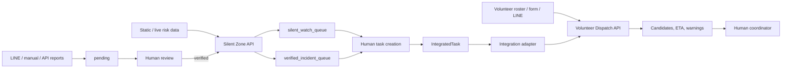

# Architecture and Integration Boundaries

## Component architecture

## Layers

1. **Silent-zone component:** produces risk results, two distinct queues, and trust metadata.
2. **Parent contract layer:** provides `IntegratedTask`, a target OpenAPI facade, and a local fixture demo.
3. **Volunteer-dispatch component:** accepts `DispatchRequest` and produces deterministic dispatch suggestions.

## Current vs target state

| Area | Verified now | Still required |
|---|---|---|
| Silent-zone analysis | Independent API and metadata exist. | Production scheduling and broader data integration. |
| Task conversion | Sample demo converts local fixtures to normalized tasks. | Automated conversion from silent-zone API output and task persistence. |
| Dispatch | Volunteer API accepts `DispatchRequest`. | Automatic adapter construction from `IntegratedTask`. |
| Integration API | Target OpenAPI contract exists. | The `/integrated-flow/dispatch-recommendations` endpoint is not implemented/deployed. |
| Human control | Warnings exist in docs/demo. | Hardened review UI, roles, and audit logging. |

## Required adapter mappings

| `IntegratedTask` | Dispatcher field | Adapter responsibility |
|---|---|---|
| `task_id` | `tasks[].id` | Direct map. |
| `task.task_type` | `tasks[].type_id` | Map to a work type. |
| priority enum | `tasks[].urgency` | Explicit mapping, e.g. low=2, medium=3, high=4, urgent=5. |
| lat/lng | `tasks[].location` | Direct map. |
| required skills | `work_types[].required_skills` | Create/merge work-type requirements. |
| area/risk | description or audit metadata | Preserve the context; do not silently discard it. |

Do not POST `IntegratedTask[]` directly to the current `/api/v1/dispatch`.

## Deployment boundary

The silent-zone API has Bearer/admin-key controls. The volunteer service needs additional production-grade external authorization, persistence, rate limiting, audit logging, and HTTPS/reverse-proxy protection before public exposure.
