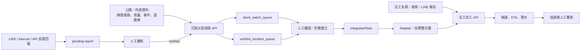

# 系統架構與整合邊界

## 元件架構

## 三個層次

### 1. 沉默災區偵測元件

輸入為風險資料、即時事件、觀測缺口與已驗證通報；輸出為：

- `silent_risk.json`、CSV、GeoJSON。
- `silent_watch_queue`：高風險且資訊不足的主動確認候選。
- `verified_incident_queue`：已有可信通報的事件清單。
- 資料狀態 metadata，例如 `data_mode`、`freshness`、`source_status`、`run_id`。

### 2. 母 repo 的整合契約

- `schemas/integrated_task.schema.json` 定義 `IntegratedTask`。
- `openapi/integrated-flow-api.yaml` 定義未來整合 façade 的目標交換格式。
- `examples/integration_demo.py` 以**本地樣本資料**驗證任務化與候選排序。

### 3. 志工派工元件

輸入為 `DispatchRequest`：

- `metadata`
- `work_types`
- `volunteers`
- `tasks`

輸出為 `DispatchResponse`：候選、ETA、信心分數、分數拆解、未指派任務與警示。

## 現況與目標的差異

| 面向 | 目前可驗證 | 尚未完成／需要 adapter |
|---|---|---|
| 風險偵測 | 子元件可獨立提供 API、資料模式與 queue。 | 生產版資料排程與更多真實資料來源。 |
| 任務轉換 | 母 repo demo 可將樣本風險資料轉為 `IntegratedTask`。 | 將沉默 API JSON 自動轉換並保存任務。 |
| 派工 | 志工 API 可接受 `DispatchRequest` 並回傳派工結果。 | 由 `IntegratedTask` 自動建構 `DispatchRequest`。 |
| 整合 API | OpenAPI 文件描述目標 façade。 | 實際 `/integrated-flow/dispatch-recommendations` 服務尚未部署。 |
| 人員決策 | demo 會提供警示。 | 人工審核 UI、權限與稽核流程需強化。 |

## 契約不相容點

`IntegratedTask` 與志工服務的 `Task` 不是同一模型：

| `IntegratedTask` | Dispatcher `Task` | adapter 責任 |
|---|---|---|
| `task_id` | `id` | 直接映射。 |
| `task.task_type` | `type_id` | 建立工作類型對應。 |
| `task.priority` (`low`–`urgent`) | `urgency`（1–5） | 建立明確映射，例如 low=2、medium=3、high=4、urgent=5。 |
| `location.lat/lng` | `location.lat/lng` | 直接映射。 |
| `required_skills` | `work_types[].required_skills` | 建立／合併工作類型。 |
| `risk` 與 `area` | 非 Dispatcher 必填欄位 | 保留於 metadata、job description 或任務稽核記錄。 |

因此，不能將 `IntegratedTask` 陣列直接 POST 到目前的 `/api/v1/dispatch`。

## 部署邊界

- 沉默元件有 Bearer Token 與高權限 `REPORT_ADMIN_KEY`；應放在 HTTPS 反向代理後。
- 志工元件目前文件未提供完整外部授權模型；正式開放前應補足 access control、管理者權限、限流、持久化與 audit log。
- 兩服務若部署於同一台主機，應使用不同內部 port，僅由反向代理公開必要路徑。
- 不要讓 public webhook、管理 API、資料 refresh 與模型服務共享未隔離的權限。
