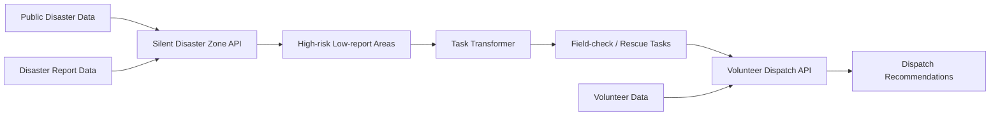
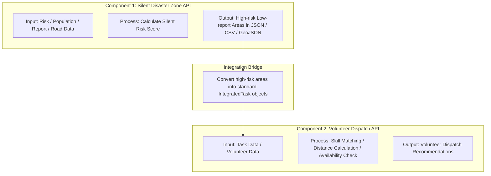
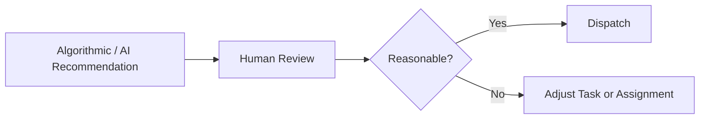

<a href="./diagrams.md">繁體中文</a> | English

# System Diagrams

## Dual Disaster Decision Chain

```mermaid
flowchart LR
    A[Public Disaster Data] --> B[Silent Disaster Zone API]
    C[Disaster Report Data] --> B
    B --> D[High-risk Low-report Areas]
    D --> E[Task Transformer]
    E --> F[Field-check / Rescue Tasks]
    F --> G[Volunteer Dispatch API]
    H[Volunteer Data] --> G
    G --> I[Dispatch Recommendations]
```

## Component Boundary

```mermaid
flowchart TB
    subgraph ComponentA[Component 1: Silent Disaster Zone API]
        A1[Input: Risk / Population / Report / Road Data]
        A2[Process: Calculate Silent Risk Score]
        A3[Output: High-risk Low-report Areas in JSON / CSV / GeoJSON]
    end

    subgraph Bridge[Integration Bridge]
        B1[Convert high-risk areas into standard IntegratedTask objects]
    end

    subgraph ComponentB[Component 2: Volunteer Dispatch API]
        C1[Input: Task Data / Volunteer Data]
        C2[Process: Skill Matching / Distance Calculation / Availability Check]
        C3[Output: Volunteer Dispatch Recommendations]
    end

    A3 --> B1 --> C1
```

## Human Review Principle

```mermaid
flowchart LR
    A[Algorithmic / AI Recommendation] --> B[Human Review]
    B --> C{Reasonable?}
    C -->|Yes| D[Dispatch]
    C -->|No| E[Adjust Task or Assignment]
```

