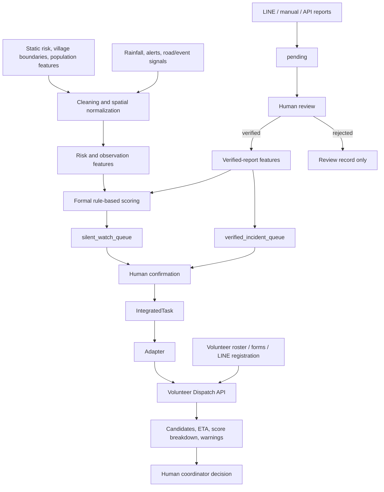
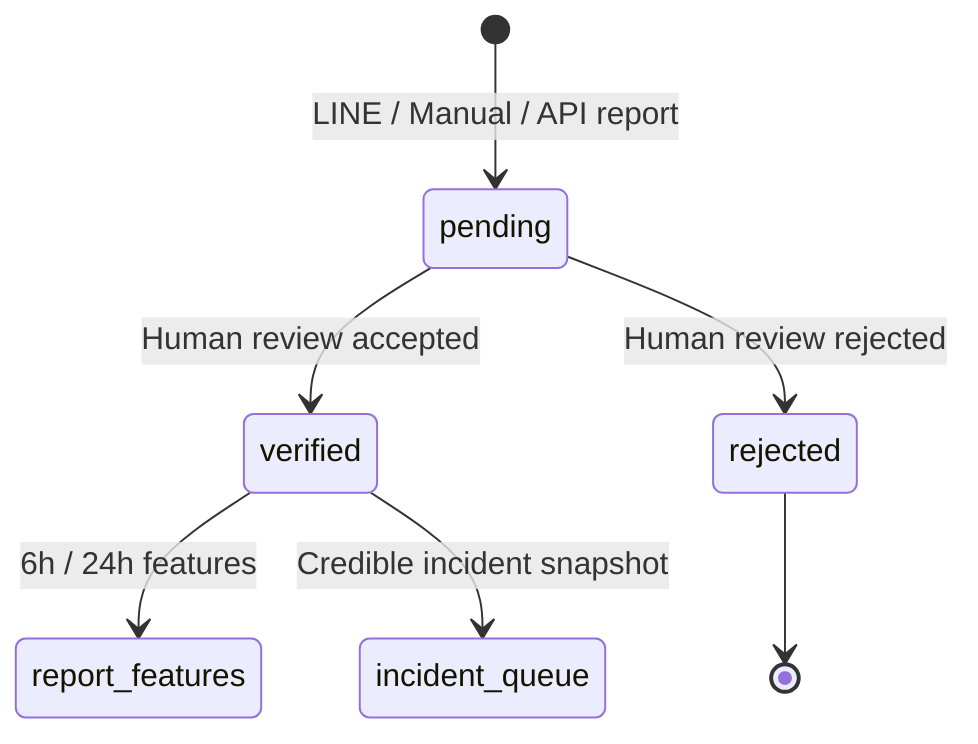
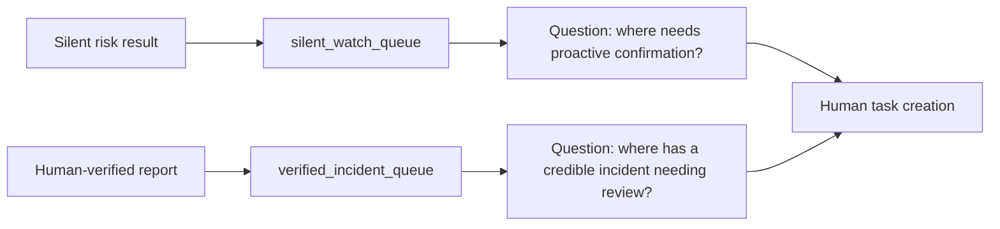
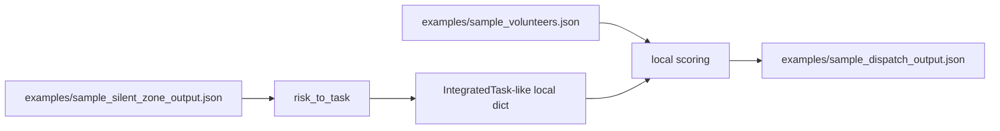
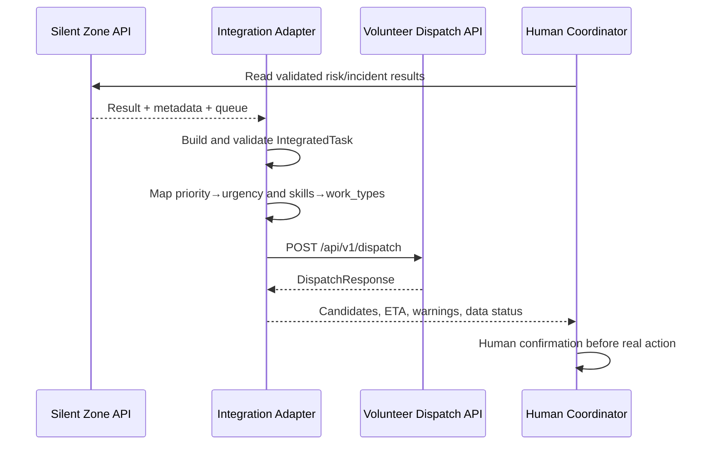

# System Diagrams

## 1. End-to-end data flow

## 2. Report lifecycle

## 3. The two queues

The queues must not be conflated. A silent-watch priority is not a disaster declaration; a verified incident is not “less important” merely because it is no longer silent.

## 4. What the current local demo actually does

The current demo uses local sample JSON and embedded Python logic; it does not invoke child-service HTTP endpoints.

## 5. Target API-to-API adapter

