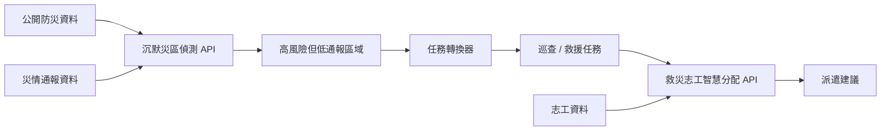
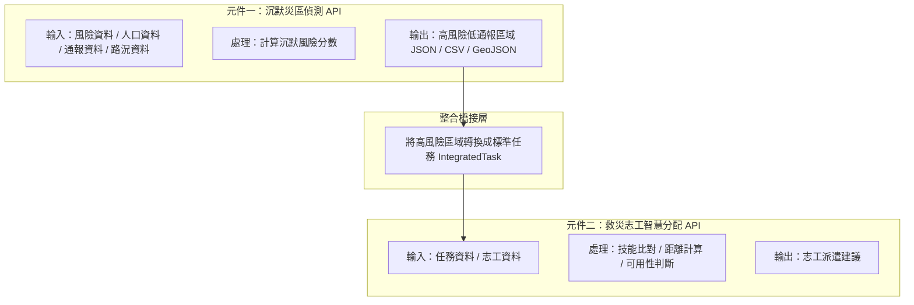
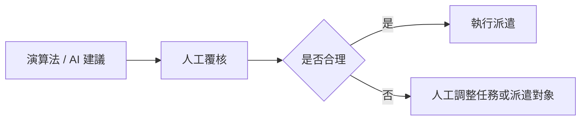

繁體中文 | <a href="./diagrams.en.md">English</a>

# 系統流程圖

## 雙元件防災決策鏈

```mermaid
flowchart LR
    A[公開防災資料] --> B[沉默災區偵測 API]
    C[災情通報資料] --> B
    B --> D[高風險但低通報區域]
    D --> E[任務轉換器]
    E --> F[巡查 / 救援任務]
    F --> G[救災志工智慧分配 API]
    H[志工資料] --> G
    G --> I[派遣建議]
```

## 元件邊界

```mermaid
flowchart TB
    subgraph ComponentA[元件一：沉默災區偵測 API]
        A1[輸入：風險資料 / 人口資料 / 通報資料 / 路況資料]
        A2[處理：計算沉默風險分數]
        A3[輸出：高風險低通報區域 JSON / CSV / GeoJSON]
    end

    subgraph Bridge[整合橋接層]
        B1[將高風險區域轉換成標準任務 IntegratedTask]
    end

    subgraph ComponentB[元件二：救災志工智慧分配 API]
        C1[輸入：任務資料 / 志工資料]
        C2[處理：技能比對 / 距離計算 / 可用性判斷]
        C3[輸出：志工派遣建議]
    end

    A3 --> B1 --> C1
```

## 人工覆核原則

```mermaid
flowchart LR
    A[演算法 / AI 建議] --> B[人工覆核]
    B --> C{是否合理}
    C -->|是| D[執行派遣]
    C -->|否| E[人工調整任務或派遣對象]
```

