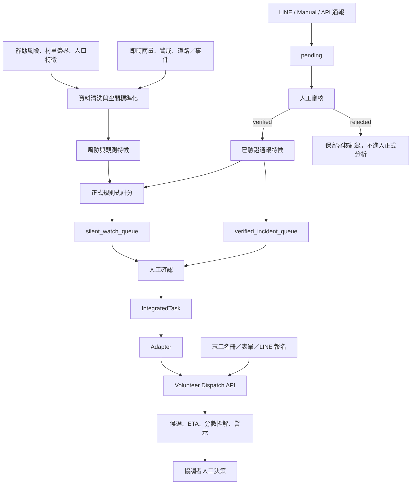
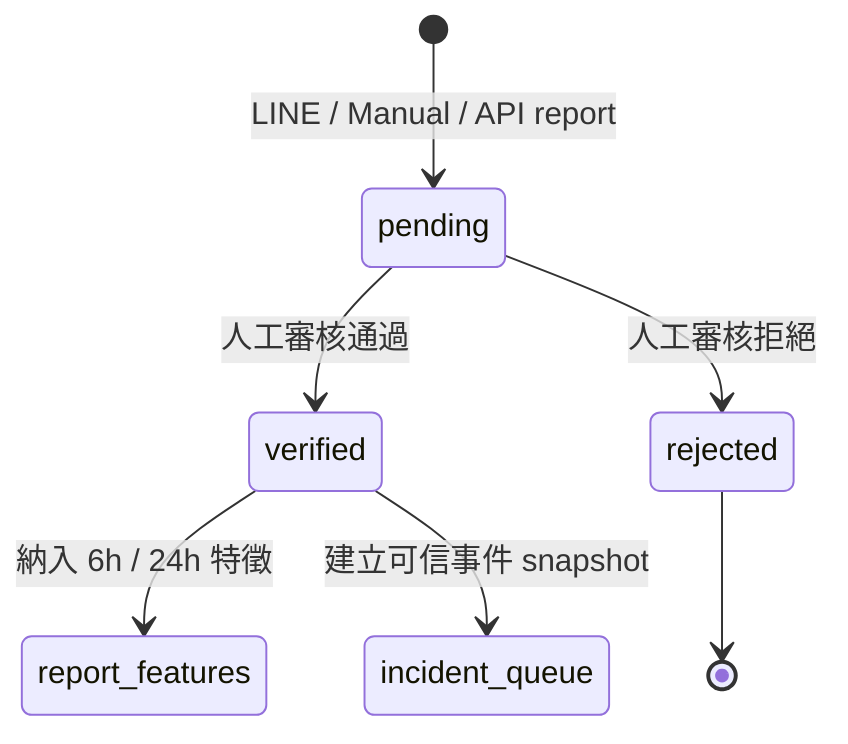
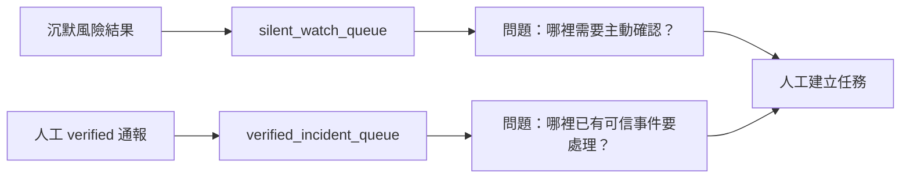
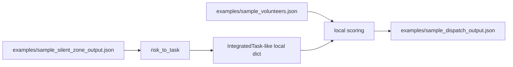
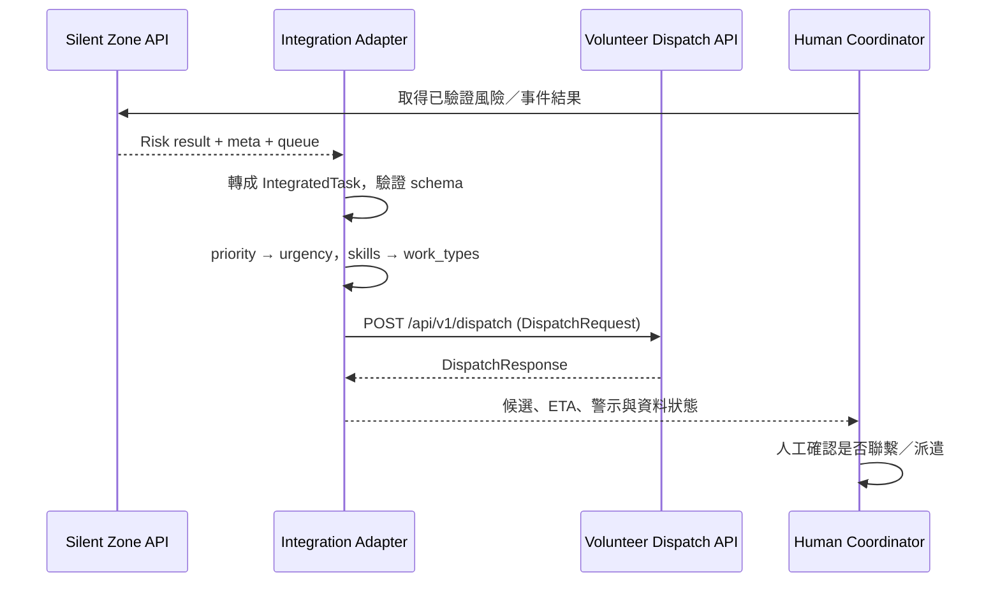
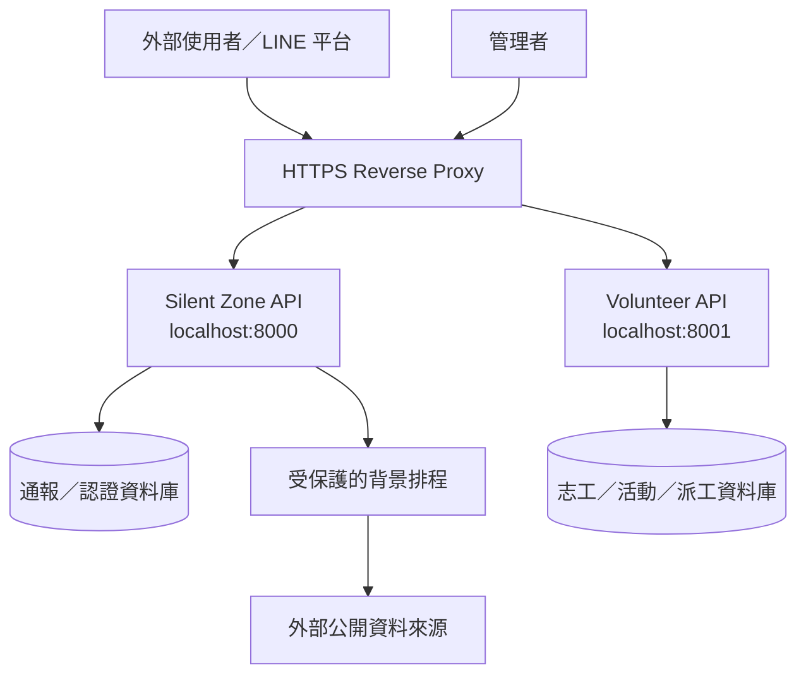

# 系統流程圖

## 1. 完整資料流

## 2. 通報生命週期

## 3. 雙隊列不可混淆

- `silent_watch_queue`：高風險、低觀測、低通報的待確認區；不是災害宣告。
- `verified_incident_queue`：已有人為可信事件資訊；不應因為「不沉默」而被忽略。

## 4. 目前離線 demo 的實際範圍

> 這張圖描述目前 `examples/integration_demo.py` 做到的事情：它使用本機樣本 JSON 和內建 Python 邏輯，沒有呼叫子服務 HTTP endpoint。

## 5. 目標 API-to-API adapter

## 6. 正式部署建議

現階段志工元件的狀態為記憶體保存；圖中的資料庫屬正式化後的目標架構。
